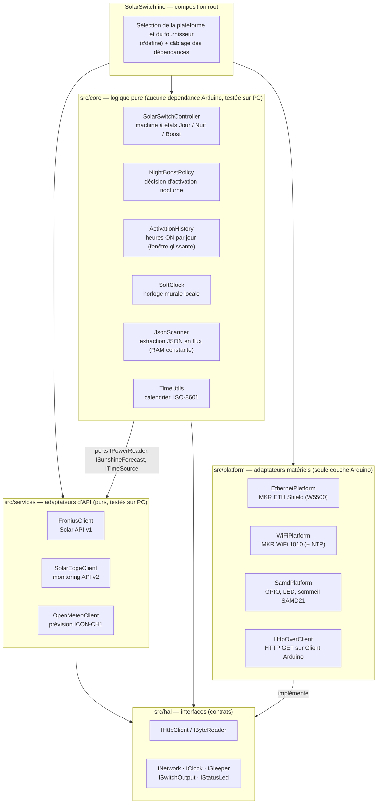
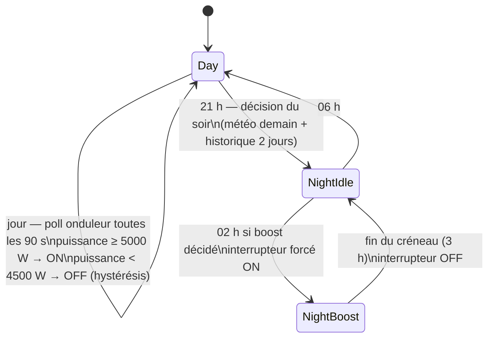

# Architecture

Réécriture de l'application « Solar Panels / Inverter Arduino Switch » selon une
architecture en couches (hexagonale / ports & adaptateurs), avec deux objectifs :

1. **Séparer la logique du hardware** — changer de carte (MKR Zero + ETH Shield,
   MKR WiFi 1010, …) ou de fournisseur d'onduleur (Fronius, SolarEdge, …) ne
   touche qu'un adaptateur, jamais la logique.
2. **Ajouter la décision météo nocturne** — le soir, l'application consulte la
   prévision d'ensoleillement du lendemain (modèle ICON-CH1 de MétéoSuisse) et,
   si la journée s'annonce sombre **et** que le boiler a peu chauffé les deux
   derniers jours, elle programme une activation nocturne à heure fixe.

## Vue d'ensemble



Règle de dépendance : les flèches pointent vers l'intérieur. `core/` ne connaît
ni Arduino, ni HTTP, ni un fournisseur d'onduleur — uniquement ses **ports**
(`IPowerReader`, `ISunshineForecast`, `ITimeSource`) et les interfaces `hal/`.

## Structure des dossiers

```
platformio.ini              — un environnement par cible + tests natifs
SolarSwitch/
  SolarSwitch.ino           — composition root : sélection + câblage, rien d'autre
  src/
    config/
      PlatformSelect.h      — choix carte (SOLAR_PLATFORM_*) et onduleur (SOLAR_INVERTER_*)
      AppConfig.h           — tous les réglages (seuils, horaires, URLs)
      Secrets.example.h     — modèle pour Secrets.h (WiFi, clés API — gitignoré)
    core/                   — logique métier pure (compilable sur PC)
    hal/                    — interfaces d'abstraction matérielle
    services/               — adaptateurs d'API (Fronius, SolarEdge, Open-Meteo)
    platform/               — implémentations Arduino des interfaces hal/
test/test_core/             — tests unitaires exécutés sur la machine hôte
legacy/main.ino             — l'ancien sketch, conservé pour référence
```

## La machine à états

`SolarSwitchController::tick()` exécute un pas et retourne le nombre de secondes
à dormir avant le prochain appel. Le `.ino` choisit alors sommeil léger ou
profond (`kDeepSleepThresholdS`).



Décision du soir (21 h, `NightBoostPolicy`) :

```
boost =  heures_activation(aujourd'hui + hier) < kMaxPastActivationHours   (6 h)
      ET ensoleillement_prévu(demain)          < kMinForecastSunshineHours (4 h)
```

Si la prévision est indisponible (panne réseau, API), le comportement est
configurable (`kBoostWhenForecastUnavailable`, défaut : pas de boost). En
journée, si l'onduleur ne répond pas, l'interrupteur retombe à OFF (fail-safe).
Le boost de la nuit compte dans l'historique d'activation du jour suivant, ce
qui évite de chauffer deux nuits de suite inutilement.

## Données météo : pourquoi Open-Meteo ?

Les données ouvertes officielles de MétéoSuisse (STAC / opendata.geo.admin.ch)
livrent les modèles ICON-CH1/CH2 en **GRIB2** : format binaire volumineux,
irréaliste à télécharger et décoder sur un SAMD21 (32 Ko de RAM).
[Open-Meteo](https://open-meteo.com) redistribue **ces mêmes modèles
MétéoSuisse** en JSON compact :

```
GET /v1/forecast?latitude=…&longitude=…&daily=sunshine_duration
    &models=icon_ch1&timezone=Europe%2FZurich&forecast_days=2
→ {"daily":{"sunshine_duration":[aujourd'hui, demain]}}   (secondes)
```

Le fournisseur météo est derrière le port `ISunshineForecast` : pour passer à
une autre source (par ex. l'API de l'app MétéoSuisse), il suffit d'écrire un
autre adaptateur dans `services/`. Points d'attention :

- **TLS** : le MKR WiFi 1010 gère HTTPS (`WiFiSSLClient`, certificats dans le
  firmware NINA). Le shield Ethernet (W5500) n'a pas de TLS : la config bascule
  en HTTP simple. Si l'API refuse le HTTP un jour, les options sont un petit
  proxy local (comme déjà fait pour SolarEdge) ou la carte WiFi.
- Vérifiez que `models=icon_ch1` couvre vos coordonnées (Suisse et proche
  frontière) ; sinon retirez le paramètre pour laisser Open-Meteo choisir.

## Le temps

Toute la logique travaille en « epoch local » (secondes, heure locale). Sources :

- **Fronius** : le champ `Timestamp` de l'API (heure locale, DST géré par
  l'onduleur) — fonctionne à l'identique en Ethernet et en WiFi, sans NTP.
- **SolarEdge** : l'API n'expose pas d'horodatage utilisable → en WiFi, NTP via
  `WiFi.getTime()` + décalage UTC configurable (`kUtcOffsetSeconds`, à ajuster
  au changement d'heure). SolarEdge + Ethernet nécessiterait un client NTP UDP
  (non fourni — le build échoue avec un message explicite).

`SoftClock` entretient l'heure entre deux synchronisations avec `millis()`.
`millis()` s'arrête pendant le sommeil SAMD, donc `SamdSleeper` réinjecte la
durée dormie après chaque réveil ; une resynchronisation périodique
(`kClockResyncIntervalS`, 6 h) corrige la dérive résiduelle.

## Portabilité : ajouter une carte ou un fournisseur

| Contrat | Rôle | Implémentations fournies |
|---|---|---|
| `INetwork` | lien réseau (begin / ensureUp) | `EthernetNetwork`, `WiFiNetwork` |
| `IHttpClient` | GET + en-têtes, corps en flux | `HttpOverClient` (tout `Client` Arduino) |
| `ISwitchOutput` | le relais | `GpioSwitch` |
| `IStatusLed` | patterns de debug | `BuiltinStatusLed` (patterns d'origine) |
| `ISleeper` | sommeil léger/profond | `SamdSleeper` |
| `IClock` | heure murale locale | `SoftClock` |
| `IPowerReader` | production onduleur (W) | `FroniusClient`, `SolarEdgeClient` |
| `ITimeSource` | référence d'heure | `FroniusClient`, `NinaTimeSource` (NTP) |
| `ISunshineForecast` | ensoleillement demain (h) | `OpenMeteoClient` |

- **Nouvelle carte** (ex. ESP32, MKR NB 1500) : implémenter `INetwork` (+ un
  `Client` Arduino pour `HttpOverClient`, ou un `IHttpClient` natif), adapter
  `ISleeper`, ajouter une branche dans le `.ino` et un environnement PlatformIO.
- **Nouvel onduleur** (ex. SMA, Huawei) : un seul fichier dans `services/`
  implémentant `IPowerReader` (~30 lignes, voir `SolarEdgeClient`), une entrée
  dans `PlatformSelect.h`/`AppConfig.h`, une branche de câblage dans le `.ino`.

## Parsing JSON en flux

Les réponses (Fronius ~1 Ko, Open-Meteo ~1 Ko, SolarEdge variable) sont lues
**octet par octet** (`JsonScanner` sur `IByteReader`) : recherche de clé exacte
avec guillemets (`"daily"` ne matche pas `"daily_units"`), extraction de
nombres, chaînes et tableaux, RAM constante (~30 octets). Les requêtes partent
en **HTTP/1.0** pour interdire le `Transfer-Encoding: chunked`, qui
intercalerait des marqueurs dans le flux JSON.

## Configuration

Tout est dans `SolarSwitch/src/config/AppConfig.h` :

| Constante | Défaut | Rôle |
|---|---|---|
| `kPowerOnThresholdW` / `kPowerOffThresholdW` | 5000 / 4500 W | seuils ON/OFF (hystérésis anti-battement) |
| `kDayPollIntervalS` | 90 s | période de poll de l'onduleur |
| `kEveningHour` / `kMorningHour` | 21 h / 6 h | fenêtre de nuit |
| `kBoostStartHour` / `kBoostDurationS` | 2 h / 3 h | créneau d'activation nocturne |
| `kMinForecastSunshineHours` | 4 h | seuil d'ensoleillement prévu |
| `kMaxPastActivationHours` / `kPastDaysWindow` | 6 h / 2 jours | seuil d'activation récente |
| `kBoostWhenForecastUnavailable` | false | comportement si la météo est injoignable |
| `kClockResyncIntervalS` | 6 h | resynchronisation de l'horloge |
| `kDeepSleepThresholdS` | 15 min | au-delà, sommeil profond (USB coupé) |

Les identifiants (WiFi, clés SolarEdge) vont dans `Secrets.h` (copier
`Secrets.example.h`, gitignoré).

## Compiler et tester

**PlatformIO** (recommandé) :

```bash
pio run -e mkrzero_eth            # MKR Zero + ETH Shield (Fronius)
pio run -e mkrwifi1010            # MKR WiFi 1010 (Fronius)
pio run -e mkrwifi1010_solaredge  # MKR WiFi 1010 (SolarEdge)
pio test -e native                # tests unitaires sur PC (18 tests)
```

**Arduino IDE** : ouvrir `SolarSwitch/SolarSwitch.ino`, choisir la cible dans
`src/config/PlatformSelect.h`, installer les bibliothèques de la cible
(Ethernet ou WiFiNINA, ArduinoLowPower).

Les tests couvrent la machine à états (cycle complet jour → décision → boost →
matin, hystérésis, redémarrage nocturne, fail-safe), l'historique d'activation
(découpage à minuit), la politique de boost, le parsing des trois APIs et
l'horloge. Ils tournent sans matériel : c'est le bénéfice direct de la
séparation logique/hardware.

## Limites connues et évolutions possibles

- L'historique d'activation survit au sommeil (RAM conservée en standby SAMD)
  mais pas à un reset → persistance possible via `FlashStorage` derrière une
  interface `IPersistence`.
- Décalage UTC fixe pour la variante NTP (changement d'heure manuel) ; la
  variante Fronius n'est pas concernée.
- Pas de TLS sur le shield Ethernet (limitation matérielle W5500).
- `LedEvent` pourrait s'enrichir (échec météo, boost actif la nuit, …).
